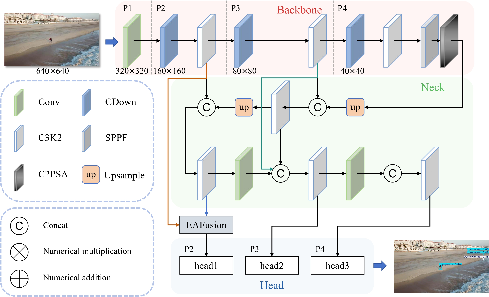

# SO-Det: A Cross-Layer Weighted Architecture with Channel-Optimized Downsampling and Enhanced Attention Fusion of Small Object Detector

 <!-- Add your framework diagram here -->

[]() <!-- Paper link to be updated -->
[](https://opensource.org/licenses/Apache-2.0)


Official implementation of **SO-Det**, a novel architecture for small object detection featuring:
- **Cross-Layer Weighted Architecture (CLWA)**
- **Channel-Optimized Downsampling (CDown)**
- **Enhanced Attention Fusion (EAFusion)**

## Abstract
###

## Models

<details open>
<summary>Detection (VisDrone)</summary>

See [VisDrone Dataset](https://github.com/VisDrone/VisDrone-Dataset) for details about this 10-class dataset.

| Model                                                                                | size<br><sup>(pixels) | mAP<sup>val<br>50 | mAP<sup>val<br>50-95 | Precision | Recall | Params<br><sup>(M) | FLOPs<br><sup>(B) |
| ------------------------------------------------------------------------------------ | --------------------- | ----------------- | -------------------- | --------- | ------ | ------------------ | ----------------- |
| [SO-Det-s](https://github.com/magic524/SO-Det/releases/download/VisDrone200/SO-Dets.pt)    | 640                   | 40.2              | 23.7                 | 49.9      | 38.9   | 1.1                | 16.3              |
| [SO-Det-m](https://github.com/magic524/SO-Det/releases/download/VisDrone200/SO-Detm.pt)    | 640                   | 46.8              | 28.0                 | 53.7      | 46.2   | 3.5                | 50.2              |
| [SO-Det-l](https://github.com/magic524/SO-Det/releases/download/VisDrone200/SO-Detx.pt)    | 640                   | 51.7              | 32.0                 | 59.6      | 50.0   | 13.1               | 182.1             |

- **Metrics** measured on VisDrone val set with input resolution 640x640.  
- Reproduce by `python val.py --data visdrone.yaml --weights so-det-s.pt --img 640`
</details>

<details>
<summary>Detection (TinyPerson)</summary>

See [TinyPerson Dataset](https://github.com/ucas-vg/TinyBenchmark) for details.

| Model                                                                                | size<br><sup>(pixels) | mAP<sup>val<br>50 | mAP<sup>val<br>50-95 | Precision | Recall | Params<br><sup>(M) | FLOPs<br><sup>(B) |
| ------------------------------------------------------------------------------------ | --------------------- | ----------------- | -------------------- | --------- | ------ | ------------------ | ----------------- |
| [SO-Det-s](https://github.com/magic524/SO-Det/releases/download/TinyPerson200/SO-Dets.pt)    | 640                   | 19.3              | 6.3                  | 32.6      | 26.0   | 1.1                | 16.3              |
| [SO-Det-m](https://github.com/magic524/SO-Det/releases/download/TinyPerson200/SO-Detm.pt)    | 640                   | 24.7              | 7.7                  | 37.4      | 28.8   | 3.5                | 50.2              |
| [SO-Det-l](https://github.com/magic524/SO-Det/releases/download/TinyPerson200/SO-Detl.pt)    | 640                   | 26.1              | 8.3                  | 41.5      | 30.6   | 13.1               | 182.1             |

- **Metrics** measured on TinyPerson val set with input resolution 640x640.  
- Reproduce by `python val.py --data tinyperson.yaml --weights so-det-s.pt --img 640`
</details>


## Installation
```bash
